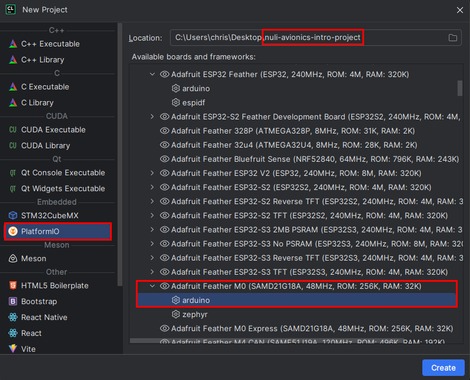
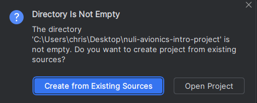
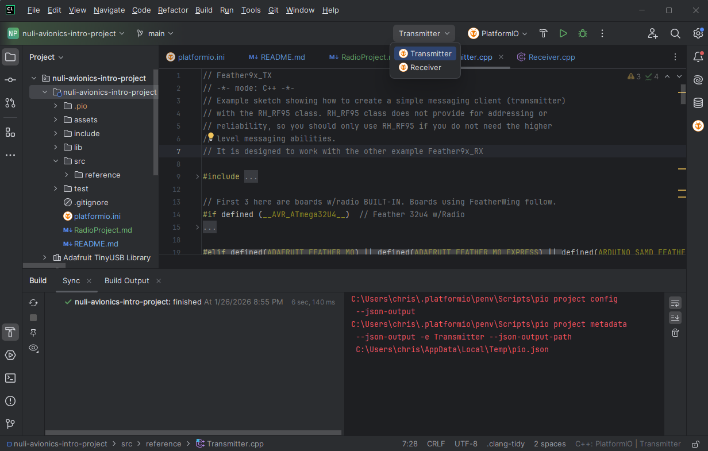
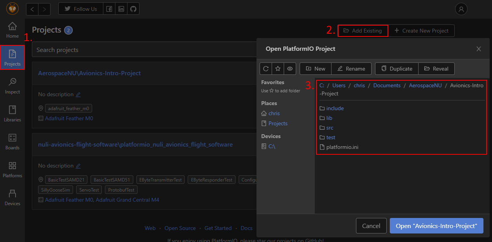
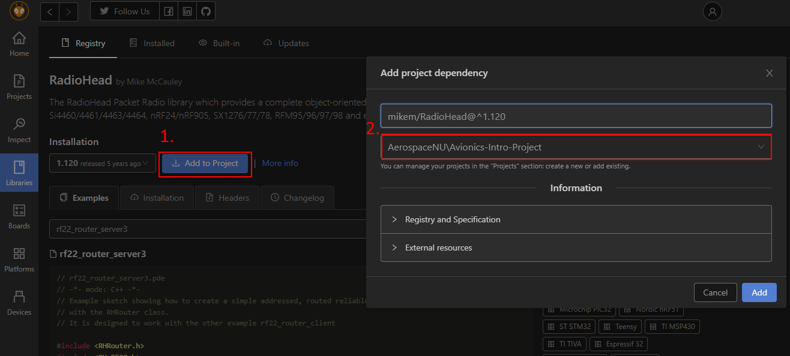
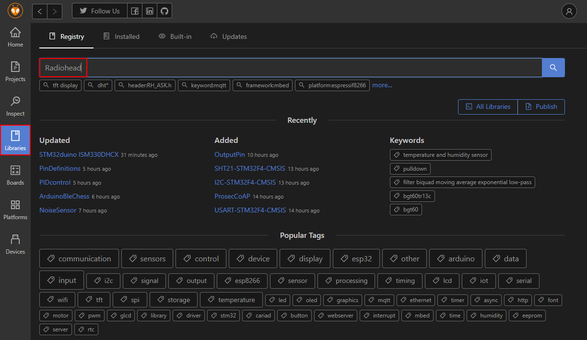

# AerospaceNU NULI Avionics Software Intro Project
## 0. Prerequisite
This guide will use CLion with PlatformIO and Git. If you do not have all
three, please refer to the README in the following repository.

https://github.com/AerospaceNU/nuli-avionics-flight-software

> 2026-19-01: You can skip the Doxygen install

## 1. Background
In this project you will be creating a radio transmitter and receiver to 
transmit GPS data. This will be based on an Arduino Feather M0 with a RFM9x 
LoRa radio. Soldered to the Feather M0 is the Adafruit Ultimate GPS 
FeatherWing, which contains a GPS module.

This is one of the most basic setups for basic communication with a rocket,
allowing for tracking and recovrey of a rocket after launch.

## 2. Getting Started
> You should have Git, CLion (or VSCode), and PlatformIO (both the program and
> the CLion extension installed at this point). 
1. Clone this repository.
2. Reload the PlatformIO project and check that everything builds. \
    `Tools > PlatformIO > Reload PlatformIO Project`

 

 Troubleshooting 

   1. Create a new project from existing source (e.g. nuli-avionics-flight-software). 
   File > New > Project > PlatformIO in the sidebar > Adafruit Feather M0 (SAMD21G18A). 
   2. Under location choose the directory containing the existing project. \
      
   3. Select `Create from Exisitng Sources` \
      
   4. Delete generated files and folders
      1. `.pio/`
      2. `src/main.cpp`
   5. Reload the PlatformIO project
      1. `Tools > PlatformIO > Reload PlatformIO Project`
   6. Build project
      1. Click the Hammer icon.
   7. You should now see something similar to the screen below \
   

3. We will be using two libraries to help out with the basic stuff. `RadioHead`
   and the `Adafruit GPS Library`. Both libraries should already be installed, 
   but below is a visual guide to adding libraries to PlatformIO

 Adding Libraries 

First, open the PlatformIO interface: `Tools > PlatformIO > PlatformIO Home`

## 3. Continue onto RadioProject.md